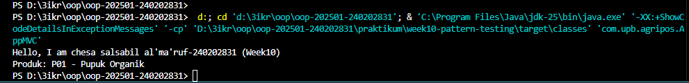
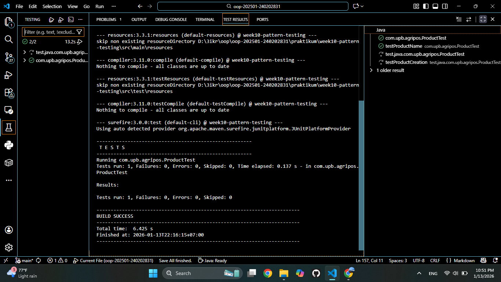

# Laporan Praktikum Minggu 10
Topik: Pattern testing
## Identitas
- Nama  : chesa salsabil al'ma'ruf
- NIM   : 240202831
- Kelas :  3IKRA

---

## Tujuan
Menjamin suatu class hanya memiliki satu instance dan menyediakan titik akses global.

Karakteristik:
- Constructor `private`
- Atribut `static instance`
- Method `static getInstance()`
---

## Dasar Teori
Design pattern adalah solusi desain yang telah teruji untuk menyelesaikan masalah umum dalam pengembangan perangkat lunak. Fokus minggu ini:
- Singleton Pattern
- MVC (Model–View–Controller)

Singleton Pattern
Tujuan: Menjamin suatu class hanya memiliki satu instance dan menyediakan titik akses global.

Karakteristik:
- Constructor `private`
- Atribut `static instance`
- Method `static getInstance()`

 MVC (Model–View–Controller)

Memisahkan tanggung jawab aplikasi:

| Komponen | Tanggung Jawab |
|---------|------------------|
| Model   | Data dan logika bisnis |
| View    | Tampilan/output |
| Controller | Penghubung Model dan View |

Contoh Struktur MVC Sederhana:
- Model → `Product`
- View → `ConsoleView`
- Controller → `ProductController`

---

## Langkah Praktikum
1. Implementasikan Singleton untuk `DatabaseConnection`.
2. Buat struktur MVC sederhana untuk fitur Product.
3. Buat minimal 1 unit test JUnit.
4. Jalankan unit test dan dokumentasikan hasilnya.

Commit message:
```
week10-pattern-testing: [fitur] [deskripsi singkat]
```

## Kode Program
DatabaseConnection.java
```java
package com.upb.agripos.config;

public class DatabaseConnection {
    private static DatabaseConnection instance;
    private DatabaseConnection() {}

    public static DatabaseConnection getInstance() {
        if (instance == null) {
            instance = new DatabaseConnection();
        }
        return instance;
    }
}
```
ProductControler
```java
package com.upb.agripos.controller;

import com.upb.agripos.model.Product;
import com.upb.agripos.view.ConsoleView;

public class ProductController {
    private final Product model;
    private final ConsoleView view;

    public ProductController(Product model, ConsoleView view) {
        this.model = model;
        this.view = view;
    }

    public void showProduct() {
        view.showMessage("Produk: " + model.getCode() + " - " + model.getName());
    }
}
```
product.java
```java
package com.upb.agripos.model;

public class Product {
    private final String code;
    private final String name;

    public Product(String code, String name) {
        this.code = code;
        this.name = name;
    }

    public String getCode() { return code; }
    public String getName() { return name; }
}
```
AppMVC.java
```java
package com.upb.agripos;

import com.upb.agripos.controller.ProductController;
import com.upb.agripos.model.Product;
import com.upb.agripos.view.ConsoleView;


public class AppMVC {
    public static void main(String[] args) {
        System.out.println("Hello, I am chesa salsabil al'ma'ruf-240202831 (Week10)");
        Product product = new Product("P01", "Benih Jagung");
        ConsoleView view = new ConsoleView();
        ProductController controller = new ProductController(product, view);
        controller.showProduct();
    }
}
```
ProducrTest.java
```java
package com.upb.agripos;

import static org.junit.jupiter.api.Assertions.*;
import org.junit.jupiter.api.Test;

import com.upb.agripos.model.Product;

public class ProductTest {

    @Test // <- Ini tanda bahwa method di bawah adalah test case
    public void testProductName() {
        Product p = new Product("P01", "Benih Jagung");
        assertEquals("Benih Jagung", p.getName());
    }
}
```
---

## Hasil Eksekusi
`output main program`


`hasil test`



---

## Analisis
(
- Jelaskan bagaimana kode berjalan.  
- Apa perbedaan pendekatan minggu ini dibanding minggu sebelumnya.  
- Kendala yang dihadapi dan cara mengatasinya.  
)
---

## Kesimpulan

- Penerapan Singleton Pattern efektif untuk menjamin efisiensi penggunaan sumber daya, seperti pada koneksi database, dengan memastikan hanya ada satu instance yang tercipta di seluruh aplikasi.

- Pola arsitektur MVC (Model-View-Controller) berhasil memisahkan tanggung jawab antara logika bisnis (Model), tampilan pengguna (View), dan penghubung antarmuka (Controller), sehingga kode menjadi lebih terorganisir dan mudah dipelihara.

- Penggunaan Unit Testing dengan JUnit sangat penting untuk menjaga kualitas perangkat lunak karena memungkinkan deteksi kesalahan secara dini melalui pengujian komponen secara mandiri sebelum aplikasi dijalankan secara utuh.

- Secara keseluruhan, kombinasi design pattern dan pengujian otomatis meningkatkan kepercayaan pengembang terhadap kode dan mempermudah proses pengembangan berkelanjutan.
---

## Quiz
1. Mengapa constructor pada Singleton harus bersifat private?

   **JAWAB :**
   Agar class lain tidak bisa membuat instance baru menggunakan keyword new. Ini memaksa akses objek hanya melalui method getInstance() untuk menjamin ketunggalan objek. 

2. Jelaskan manfaat pemisahan Model, View, dan Controller.  
   **Jawaban:** 
   - Maintenance: Mengubah tampilan (View) tidak merusak logika bisnis (Model).

   - Scalability: Tim bisa bekerja paralel (satu orang mengerjakan UI, satu lagi mengerjakan logika).

   - Testability: Logika bisnis (Model/Controller) lebih mudah di-test tanpa ketergantungan pada UI.

3. Apa peran unit testing dalam menjaga kualitas perangkat lunak?  
   **Jawaban:**
   - Mendeteksi bug sejak dini sebelum kode digabung ke sistem besar.
   - Berfungsi sebagai dokumentasi hidup tentang cara kerja kode.
   - Memberikan rasa aman saat melakukan perubahan kode (refactoring), karena test akan memberitahu jika ada fitur yang rusak.   
4. Apa risiko jika Singleton tidak diimplementasikan dengan benar?

   **JAWAB**

   Risiko utamanya adalah Race Condition pada lingkungan multithreading. Jika dua thread mengakses getInstance() secara bersamaan saat instance belum dibuat, kedua thread mungkin akan membuat instance baru masing-masing. Hal ini melanggar prinsip Singleton (tercipta lebih dari satu objek) dan dapat menyebabkan inkonsistensi data atau pemborosan resource.
