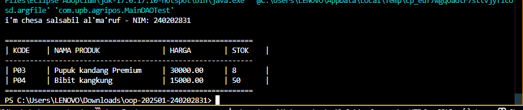

# Laporan Praktikum Minggu 11
**Topik:** Data Access Object (DAO) dan CRUD Database dengan JDBC

## Identitas
- **Nama** : [Isi Nama Mahasiswa]
- **NIM** : [Isi NIM Mahasiswa]
- **Kelas** : [Isi Kelas]

---

## Tujuan
1. Menjelaskan konsep Data Access Object (DAO) dalam pengembangan aplikasi OOP.
2. Menghubungkan aplikasi Java dengan basis data PostgreSQL menggunakan JDBC.
3. Mengimplementasikan operasi CRUD (Create, Read, Update, Delete) secara lengkap.
4. Mengintegrasikan DAO dengan class aplikasi OOP sesuai prinsip desain yang baik.

---

## Dasar Teori
1. **Pola Desain DAO**: Memisahkan logika akses data dari logika bisnis aplikasi agar perubahan teknologi basis data tidak memengaruhi logika utama aplikasi.
2. **JDBC (Java Database Connectivity)**: Spesifikasi standar untuk menghubungkan aplikasi Java dengan berbagai sistem manajemen basis data relasional.
3. **PreparedStatement**: Digunakan untuk menjalankan query SQL yang terparameter, meningkatkan keamanan dari SQL Injection dan efisiensi eksekusi.
4. **Enkapsulasi Data**: Penggunaan class Model (seperti `Product`) untuk membungkus data tabel menjadi objek Java.

---

## Langkah Praktikum
1. **Persiapan Database**: Membuat database `agripos` dan tabel `products` melalui PostgreSQL Shell.
2. **Konfigurasi Proyek**: Menyusun file `pom.xml` dengan dependensi `postgresql` dan `exec-maven-plugin`.
3. **Implementasi Kode**: Membuat class model `Product`, interface `ProductDAO`, dan class implementasi `ProductDAOImpl`.
4. **Pengujian**: Menjalankan kelas `MainDAOTest` untuk memverifikasi alur CRUD dari Insert hingga Find.
5. **Verifikasi**: Memastikan data tersimpan permanen di PostgreSQL menggunakan perintah `SELECT`.

---

## Kode Program
### 1. Basis Data

Gunakan PostgreSQL dengan ketentuan minimal berikut:

Nama database: `agripos`

Struktur tabel produk:
```sql
CREATE TABLE products (
    code VARCHAR(10) PRIMARY KEY,
    name VARCHAR(100),
    price DOUBLE PRECISION,
    stock INT
);
```

---

### 2. Class Model – Product

```java
package com.upb.agripos.model;

public class Product {
    private final String code; // Dijadikan final sesuai saran IDE
    private String name;
    private double price;
    private int stock;

    public Product(String code, String name, double price, int stock) {
        this.code = code;
        this.name = name;
        this.price = price;
        this.stock = stock;
    }

    public String getCode() { return code; }
    public String getName() { return name; }
    public double getPrice() { return price; }
    public int getStock() { return stock; }

    public void setName(String name) { this.name = name; }
    public void setPrice(double price) { this.price = price; }
    public void setStock(int stock) { this.stock = stock; }

    @Override
    public String toString() {
        return String.format("| %-7s | %-25s | %-12.2f | %-7d |", 
                             code, name, price, stock);
    }
}
```

---

### 3. Interface DAO

```java
package com.upb.agripos.dao;

import java.util.List;
import com.upb.agripos.model.Product;

public interface ProductDAO {
    void insert(Product product) throws Exception;
    Product findByCode(String code) throws Exception;
    List<Product> findAll() throws Exception;
    void update(Product product) throws Exception;
    void delete(String code) throws Exception;
}
```

---

### 4. Implementasi DAO dengan JDBC

Implementasi DAO harus menggunakan PreparedStatement.

```java
package com.upb.agripos.dao;

import java.sql.*;
import java.util.ArrayList;
import java.util.List;
import com.upb.agripos.model.Product;

public class ProductDAOImpl implements ProductDAO {

    private final Connection connection;

    public ProductDAOImpl(Connection connection) {
        this.connection = connection;
    }

    @Override
    public void insert(Product p) throws Exception {
        String sql = "INSERT INTO products(code, name, price, stock) VALUES (?, ?, ?, ?)";
        try (PreparedStatement ps = connection.prepareStatement(sql)) {
            ps.setString(1, p.getCode());
            ps.setString(2, p.getName());
            ps.setDouble(3, p.getPrice());
            ps.setInt(4, p.getStock());
            ps.executeUpdate();
        }
    }

    @Override
    public Product findByCode(String code) throws Exception {
        String sql = "SELECT * FROM products WHERE code = ?";
        try (PreparedStatement ps = connection.prepareStatement(sql)) {
            ps.setString(1, code);
            try (ResultSet rs = ps.executeQuery()) {
                if (rs.next()) {
                    return new Product(
                        rs.getString("code"),
                        rs.getString("name"),
                        rs.getDouble("price"),
                        rs.getInt("stock")
                    );
                }
            }
        }
        return null;
    }

    @Override
    public List<Product> findAll() throws Exception {
        List<Product> list = new ArrayList<>();
        String sql = "SELECT * FROM products";
        try (PreparedStatement ps = connection.prepareStatement(sql);
             ResultSet rs = ps.executeQuery()) {
            while (rs.next()) {
                list.add(new Product(
                    rs.getString("code"),
                    rs.getString("name"),
                    rs.getDouble("price"),
                    rs.getInt("stock")
                ));
            }
        }
        return list;
    }

    @Override
    public void update(Product p) throws Exception {
        String sql = "UPDATE products SET name=?, price=?, stock=? WHERE code=?";
        try (PreparedStatement ps = connection.prepareStatement(sql)) {
            ps.setString(1, p.getName());
            ps.setDouble(2, p.getPrice());
            ps.setInt(3, p.getStock());
            ps.setString(4, p.getCode());
            ps.executeUpdate();
        }
    }

    @Override
    public void delete(String code) throws Exception {
        String sql = "DELETE FROM products WHERE code=?";
        try (PreparedStatement ps = connection.prepareStatement(sql)) {
            ps.setString(1, code);
            ps.executeUpdate();
        }
    }
}
```

---

## Integrasi DAO dengan Aplikasi

DAO tidak boleh dipanggil langsung oleh UI. Integrasi dilakukan melalui class aplikasi (misalnya `MainDAOTest`) atau service.

```java
package com.upb.agripos;

import java.sql.Connection;
import java.sql.DriverManager;
import java.util.List;

import com.upb.agripos.dao.ProductDAO;
import com.upb.agripos.dao.ProductDAOImpl;
import com.upb.agripos.model.Product;

public class MainDAOTest {
    public static void main(String[] args) {
        String url = "jdbc:postgresql://localhost:5432/agripos";
        String user = "postgres";
        String pass = "admin123"; 

        // Menggunakan try-with-resources sesuai saran hint IDE
        try (Connection conn = DriverManager.getConnection(url, user, pass)) {
            ProductDAO dao = new ProductDAOImpl(conn);

            // Operasi CRUD
            dao.insert(new Product("P03", "Pupuk kandang", 25000, 10));
            dao.update(new Product("P03", "Pupuk kandang Premium ", 30000, 8));
            dao.insert(new Product("P04", "Bibit kangkung", 15000, 50));

            // Mencetak Header Tabel
            printHeader();

            // Mengambil semua data dan mencetaknya secara detail
            List<Product> products = dao.findAll();
            for (Product p : products) {
                System.out.println(p);
            }
            
            printFooter();

        } catch (Exception e) {
            System.err.println("Error: " + e.getMessage());
        }
    }


    private static void printHeader() {
        System.out.println("i'm chesa salsabil al'ma'ruf - NIM: 240202831");
        System.out.println("\n" + "=".repeat(60));
        System.out.printf("| %-7s | %-25s | %-12s | %-7s |\n", "KODE", "NAMA PRODUK", "HARGA", "STOK");
        System.out.println("-".repeat(60));
    }
        

        
    private static void printFooter() {
        System.out.println("=".repeat(60));
    }
}
```

---
## Hasil Eksekusi
(Sertakan screenshot hasil eksekusi program.  

)
---

## Analisis
Analisis
- Alur Program: Program memulai dengan membuka koneksi JDBC ke database agripos. Objek ProductDAOImpl kemudian digunakan untuk mengirim perintah SQL melalui PreparedStatement.

- Kelebihan DAO: Dengan struktur ini, jika database diganti (misal ke MySQL), kita hanya perlu mengubah ProductDAOImpl tanpa menyentuh kode di MainDAOTest.

- Penanganan Masalah: Kendala utama adalah konfigurasi pom.xml yang sempat error karena tag yang tidak tertutup. Masalah diatasi dengan melengkapi tag </project> dan memastikan direktori eksekusi sudah benar.
---

## Kesimpulan
Praktikum ini berhasil membuktikan bahwa penggunaan pola DAO membuat kode aplikasi lebih terstruktur, modular, dan mudah dipelihara. Integrasi JDBC dengan PostgreSQL memungkinkan data aplikasi disimpan secara persisten di luar siklus hidup program Java.

---

## Quiz
1. Mengapa DAO dipisahkan dari class Model? Jawaban: Agar class Model fokus hanya sebagai representasi data (POJO), sedangkan DAO fokus pada logika operasional data ke database.

2. Apa peran Driver Manager dalam JDBC? Jawaban: Driver Manager bertugas mengelola set driver JDBC yang tersedia dan memfasilitasi pembuatan koneksi antara aplikasi Java dan database berdasarkan URL yang diberikan.
