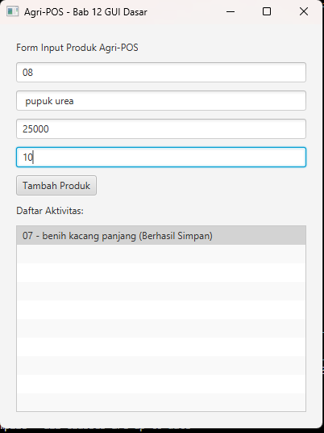

# Laporan Praktikum Minggu 1 (sesuaikan minggu ke berapa?)
Topik: [Tuliskan judul topik, misalnya "Class dan Object"]

## Identitas
- Nama  : [chesa salsabil al'ma'ruf]
- NIM   : [240202831]
- Kelas : [3ikra]

---

## Tujuan
1. Menjelaskan konsep event-driven programming.
2. Membangun antarmuka grafis sederhana menggunakan JavaFX.
3. Membuat form input data produk.
4. Menampilkan daftar produk pada GUI.
5. Mengintegrasikan GUI dengan modul backend yang telah dibuat (DAO & Service).
---

## Dasar Teori
1. JavaFX & Event Handling: JavaFX adalah pustaka Java untuk membangun aplikasi desktop modern. Event Handling adalah mekanisme di mana kode bereaksi terhadap tindakan pengguna (seperti klik tombol), yang ditangani oleh Controller.

2. Interface-Based Programming: Dalam desain yang baik, ketergantungan antar-objek sebaiknya melalui Interface, bukan kelas konkret. Hal ini mewajibkan setiap perubahan pada Interface diikuti dengan pembaruan pada kelas Implementasinya (implements).

3. Dependency Injection (DI): Teknik menyuntikkan objek ketergantungan (seperti ProductDAO) ke dalam objek yang membutuhkannya (ProductService) melalui konstruktor, memudahkan pengujian dan pemeliharaan kode.

4. Maven Lifecycle: Proses build otomatis (Clean, Compile, Run) yang memastikan kode biner (.class) selalu diperbarui sesuai dengan kode sumber (.java) terbaru

---

## Langkah Praktikum
1. Persiapan Database: Memastikan PostgreSQL berjalan dan tabel products siap digunakan.

2. Implementasi DAO (ProductDAOImpl): Menulis ulang logika JDBC untuk menangani query SQL INSERT dan UPDATE stok secara terpisah.

3. Integrasi GUI (ProductController & View): Menghubungkan tombol "Impor" di View ke metode handleImport di Controller.

4. commit week 12


---

## Kode Program

Melanjutkandari week 11, mengganti main program dan menambahkan:

``controler\productControler.java``

```java
package com.upb.agripos.controller;

import com.upb.agripos.model.Product;
import com.upb.agripos.service.ProductService;

import javafx.scene.control.ListView;
import javafx.scene.control.TextField;

public class ProductController {
    private final ProductService service;

    public ProductController(ProductService service) {
        this.service = service;
    }

    public void handleAddProduct(TextField txtCode, TextField txtName, 
                                 TextField txtPrice, TextField txtStock, 
                                 ListView<String> listView) {
        try {
            // Mapping data dari GUI ke Model
            Product p = new Product(
                txtCode.getText(),
                txtName.getText(),
                Double.parseDouble(txtPrice.getText()),
                Integer.parseInt(txtStock.getText())
            );

            service.insert(p); // Panggil service
            listView.getItems().add(p.getCode() + " - " + p.getName() + " (Berhasil Simpan)");
            
            // Bersihkan form
            txtCode.clear(); txtName.clear(); txtPrice.clear(); txtStock.clear();
        } catch (Exception e) {
            listView.getItems().add("Error: " + e.getMessage());
        }
    }
}
```


## Hasil Eksekusi
(Sertakan screenshot hasil eksekusi program.  

)
---

## Analisis

- iKonfigurasi Environment: Aplikasi sempat gagal berjalan dengan pesan JAVA_HOME environment variable is not defined. Ini menunjukkan bahwa terminal tidak mengenali lokasi JDK. Masalah diatasi dengan mengatur path JAVA_HOME secara manual ke direktori instalasi Eclipse Adoptium JDK 17.

- Alur Logika "Impor": Berbeda dengan operasi CRUD biasa, fitur "Impor" menggunakan logika kondisional. Aplikasi tidak menolak data jika kode produk sama, melainkan mengakumulasi stok. Ini sesuai dengan kebutuhan gudang/toko di dunia nyata, di mana barang masuk menambah persediaan, bukan menimpa data barang.
---

## Kesimpulan
Praktikum ini menunjukkan pentingnya konsistensi dalam arsitektur berlayer (MVC). Perubahan nama metode pada satu layer (misal: Interface DAO) wajib diikuti perubahan pada layer implementasi dan pemanggilnya. Selain itu, pemahaman tentang environment variables dan perintah dasar Maven (clean compile) sangat krusial untuk mengatasi masalah teknis di luar kode program. Penggunaan JavaFX terbukti efektif memisahkan tampilan (View) dari logika bisnis (Service), membuat kode lebih terstruktur dan mudah dikelola.
---

