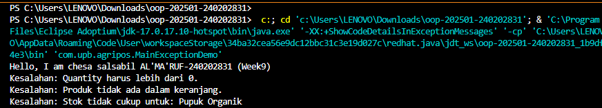

# Laporan Praktikum Minggu 9
Topik: Exception Handling, Custom Exception, dan Penerapan Design Pattern

## Identitas
- **Nama** : [Nama Lengkap Anda]
- **NIM** : [NIM Anda]
- **Kelas** : [Kelas Anda]

---

## Tujuan
1. Mahasiswa mampu menjelaskan perbedaan antara error dan exception.
2. Mahasiswa mampu mengimplementasikan blok `try–catch–finally` dengan tepat.
3. Mahasiswa mampu membuat *custom exception* (pengecualian khusus) sesuai kebutuhan logika bisnis program.
4. Mahasiswa mampu mengintegrasikan *exception handling* ke dalam aplikasi sederhana (kasus keranjang belanja Agri-POS).

---

## Dasar Teori
1. **Error vs Exception**
   *Error* adalah kondisi fatal yang biasanya bersumber dari sistem (seperti `OutOfMemoryError`) dan sulit dipulihkan. Sedangkan *Exception* adalah kondisi abnormal atau kesalahan logika yang dapat ditangani (di-*catch*) oleh program agar tidak berhenti secara mendadak.

2. **Struktur Try-Catch-Finally**
   Blok `try` berisi kode yang berisiko error, blok `catch` menangkap dan menangani error tersebut, dan blok `finally` berisi kode yang akan selalu dijalankan (biasanya untuk *cleanup resource*), baik terjadi error maupun tidak.

3. **Custom Exception**
   Dalam pengembangan aplikasi bisnis, exception bawaan Java seringkali terlalu umum. Kita dapat membuat class exception sendiri (mewarisi class `Exception`) untuk menangani kasus spesifik, seperti `InsufficientStockException` atau `InvalidQuantityException`.

---

## Langkah Praktikum
Langkah-langkah yang dilakukan dalam praktikum ini adalah:
1. **Setup Package**: Menyiapkan package `com.upb.agripos`.
2. **Pembuatan Custom Exception**: Membuat class `InvalidQuantityException`, `ProductNotFoundException`, dan `InsufficientStockException`.
3. **Pembuatan Model**: Mengimplementasikan class `Product` yang memiliki atribut stok dan metode pengurangan stok.
4. **Coding Logic**: Mengembangkan class `ShoppingCart` menggunakan `HashMap` untuk menyimpan item dan menyisipkan keyword `throws` pada metode yang berisiko.
5. **Running & Testing**: Membuat class `MainExceptionDemo` untuk menguji berbagai skenario kesalahan dalam blok `try-catch`.
6. **Commit**: Melakukan penyimpanan perubahan dengan pesan commit `week9-exception: integrasi exception handling pada method tambahProduk, hapusProduk, dan checkout`.
---

## Kode Program
```java
package com.upb.agripos;

public class InvalidQuantityException extends Exception {
    public InvalidQuantityException(String msg) { super(msg); }
}
```

```java
package com.upb.agripos;

public class ProductNotFoundException extends Exception {
    public ProductNotFoundException(String msg) { super(msg); }
}
```

```java
package com.upb.agripos;

public class InsufficientStockException extends Exception {
    public InsufficientStockException(String msg) { super(msg); }
}
```

### 2. Model Product dengan Stok

```java
package com.upb.agripos;

public class Product {
    private final String code;
    private final String name;
    private final double price;
    private int stock;

    public Product(String code, String name, double price, int stock) {
        this.code = code;
        this.name = name;
        this.price = price;
        this.stock = stock;
    }

    public String getCode() { return code; }
    public String getName() { return name; }
    public double getPrice() { return price; }
    public int getStock() { return stock; }
    public void reduceStock(int qty) { this.stock -= qty; }
}
```

### 3. Implementasi ShoppingCart dengan Exception Handling

```java
package com.upb.agripos;

import java.util.HashMap;
import java.util.Map;

public class ShoppingCart {
    private final Map<Product, Integer> items = new HashMap<>();

    public void addProduct(Product p, int qty) throws InvalidQuantityException {
        if (qty <= 0) {
            throw new InvalidQuantityException("Quantity harus lebih dari 0.");
        }
        items.put(p, items.getOrDefault(p, 0) + qty);
    }

    public void removeProduct(Product p) throws ProductNotFoundException {
        if (!items.containsKey(p)) {
            throw new ProductNotFoundException("Produk tidak ada dalam keranjang.");
        }
        items.remove(p);
    }

    public void checkout() throws InsufficientStockException {
        for (Map.Entry<Product, Integer> entry : items.entrySet()) {
            Product product = entry.getKey();
            int qty = entry.getValue();
            if (product.getStock() < qty) {
                throw new InsufficientStockException(
                    "Stok tidak cukup untuk: " + product.getName()
                );
            }
        }
        // contoh pengurangan stok bila semua cukup
        for (Map.Entry<Product, Integer> entry : items.entrySet()) {
            entry.getKey().reduceStock(entry.getValue());
        }
    }
}
```

### 4. Main Program untuk Menguji Exception Handling

```java
package com.upb.agripos;

public class MainExceptionDemo {
    public static void main(String[] args) {
        System.out.println("Hello, I am [Nama]-[NIM] (Week9)");

        ShoppingCart cart = new ShoppingCart();
        Product p1 = new Product("P01", "Pupuk Organik", 25000, 3);

        try {
            cart.addProduct(p1, -1);
        } catch (InvalidQuantityException e) {
            System.out.println("Kesalahan: " + e.getMessage());
        }

        try {
            cart.removeProduct(p1);
        } catch (ProductNotFoundException e) {
            System.out.println("Kesalahan: " + e.getMessage());
        }

        try {
            cart.addProduct(p1, 5);
            cart.checkout();
        } catch (Exception e) {
            System.out.println("Kesalahan: " + e.getMessage());
        }
    }
}
```

## Hasil Eksekusi
(Sertakan screenshot hasil eksekusi program.  

)
---

---

## Analisis
Analisis pengerjaan praktikum minggu ke-9 ini adalah:
- **Alur Program**: Kode berjalan dengan melakukan validasi di awal setiap operasi penting seperti tambah barang, hapus, dan checkout. Jika validasi gagal, objek Exception dilempar (*throw*) ke pemanggil utama (main).
- **Perbedaan**: Dibandingkan minggu sebelumnya, validasi tidak lagi menggunakan nilai kembalian (*return value*) atau sekadar mencetak pesan, melainkan menggunakan mekanisme `throw` yang memaksa pemanggil untuk menangani error tersebut dalam blok `try-catch`.
- **Kendala**: Tantangan muncul saat menentukan pesan error yang informatif agar pengguna memahami bagian stok mana yang kurang atau alasan mengapa kuantitas ditolak.

---

## Kesimpulan
Kesimpulan dari praktikum ini adalah penggunaan *Exception Handling* membuat aplikasi menjadi lebih "tahan banting" terhadap input yang tidak valid. Dengan memisahkan logika utama dan penanganan kesalahan, kode program menjadi lebih bersih, terstruktur, dan mudah untuk dikembangkan di masa depan.

---

## Quiz
1. **Jelaskan perbedaan error dan exception.** **Jawaban:** *Error* adalah kondisi fatal (*unrecoverable*) yang berasal dari sistem atau JVM, sedangkan *Exception* adalah kondisi tidak normal yang dapat dipulihkan atau ditangani oleh program melalui kode.

2. **Apa fungsi finally dalam blok try–catch–finally?** **Jawaban:** Blok `finally` digunakan untuk mengeksekusi kode yang harus tetap berjalan, baik terjadi kesalahan maupun tidak, seperti menutup koneksi resource atau pembersihan data.

3. **Mengapa custom exception diperlukan?** **Jawaban:** Agar program memiliki identifikasi kesalahan yang spesifik sesuai dengan aturan bisnis (misalnya stok habis), sehingga penanganannya lebih akurat daripada menggunakan exception umum bawaan Java.

4. **Berikan contoh kasus bisnis dalam POS yang membutuhkan custom exception.** **Jawaban:** Contohnya adalah `PaymentDeclinedException` saat transaksi gagal, `VoucherExpiredException` saat diskon sudah tidak berlaku, atau `InsufficientStockException` saat stok barang di gudang tidak mencukupi permintaan pelanggan.
